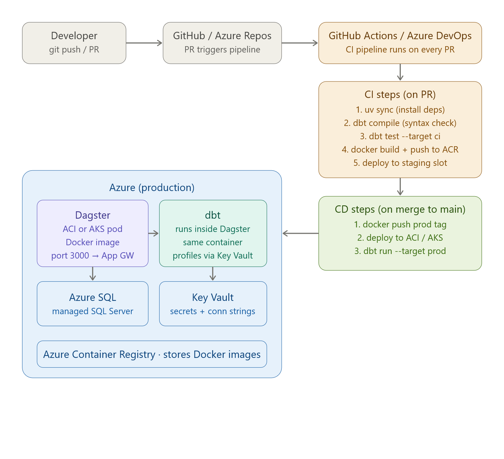
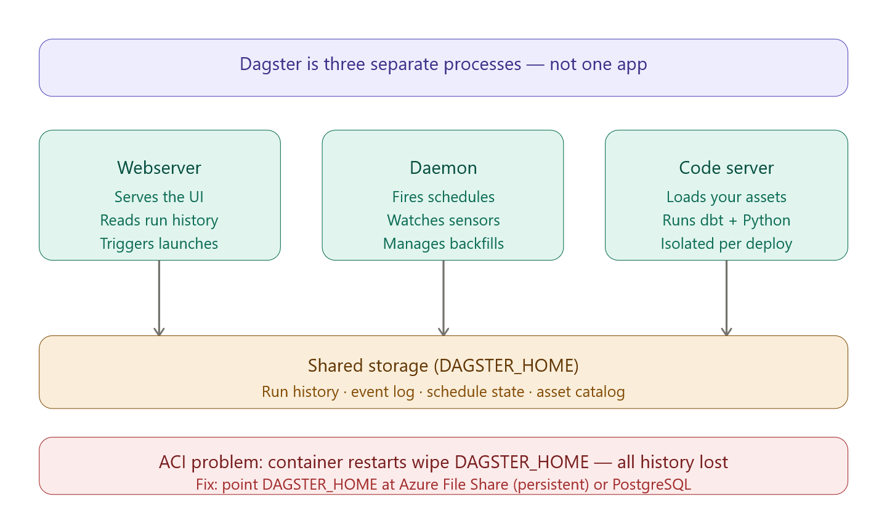
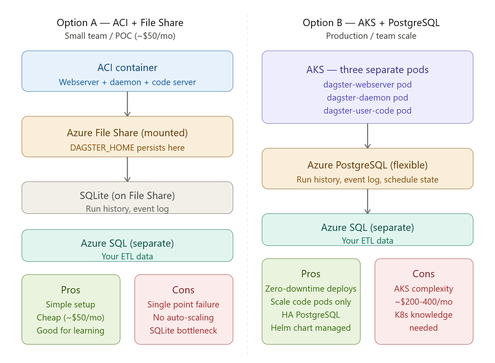

# Diagram 



Part 1 — Dockerize your project
Everything runs from one image. Create Dockerfile at the project root:

```
FROM python/3.12-slim

# Install ODBC driver for SQL Server
RUN apt-get update && apt-get install -y \
    curl gnupg2 unixodbc-dev \
    && curl https://packages.microsoft.com/keys/microsoft.asc | apt-key add - \
    && curl https://packages.microsoft.com/config/debian/11/prod.list \
       > /etc/apt/sources.list.d/mssql-release.list \
    && apt-get update \
    && ACCEPT_EULA=Y apt-get install -y msodbcsql17 \
    && rm -rf /var/lib/apt/lists/*

# Install uv
RUN pip install uv

WORKDIR /app
COPY pyproject.toml uv.lock* ./
RUN uv sync --frozen

COPY . .

# Generate dbt manifest at build time
RUN cd dbt_project && uv run dbt deps --profiles-dir . && uv run dbt parse --profiles-dir .

EXPOSE 3000

CMD ["uv", "run", "dagster", "dev", "-m", "dagster_project", "--host", "0.0.0.0"]
```

**`.dockerignore`**:
```
.venv
__pycache__
*.pyc
dbt_project/target
dbt_project/dbt_packages
.env
```


Part 2 — dbt profiles for multiple environments
Replace your profiles.yml with environment-variable-driven config so the same image works in dev, staging, and prod:
dbt_project/profiles.yml:

```
etl_poc:
  target: "{{ env_var('DBT_TARGET', 'dev') }}"
  outputs:
    dev:
      type: sqlserver
      driver: "ODBC Driver 17 for SQL Server"
      server: "{{ env_var('DBT_SQLSERVER_HOST', 'localhost') }}"
      port: 1433
      database: "{{ env_var('DBT_SQLSERVER_DATABASE', 'etl_poc') }}"
      schema: dest_schema
      user: "{{ env_var('DBT_SQLSERVER_USER', 'sa') }}"
      password: "{{ env_var('DBT_SQLSERVER_PASSWORD') }}"
      trust_cert: true

    prod:
      type: sqlserver
      driver: "ODBC Driver 17 for SQL Server"
      server: "{{ env_var('DBT_SQLSERVER_HOST') }}"
      port: 1433
      database: "{{ env_var('DBT_SQLSERVER_DATABASE') }}"
      schema: dest_schema
      user: "{{ env_var('DBT_SQLSERVER_USER') }}"
      password: "{{ env_var('DBT_SQLSERVER_PASSWORD') }}"
      trust_cert: false   # use proper cert in prod
```

Part 3 — GitHub Actions CI/CD pipeline
Create .github/workflows/deploy.yml:


```
name: ETL Pipeline CI/CD

on:
  pull_request:
    branches: [main]
  push:
    branches: [main]

env:
  ACR_REGISTRY: yourregistry.azurecr.io
  IMAGE_NAME: etl-poc

jobs:
  # ── CI: runs on every PR ──────────────────────────────────────────
  ci:
    name: CI — lint, compile, test
    runs-on: ubuntu-latest
    if: github.event_name == 'pull_request'

    services:
      sqlserver:
        image: mcr.microsoft.com/mssql/server:2022-latest
        env:
          SA_PASSWORD: ${{ secrets.CI_DB_PASSWORD }}
          ACCEPT_EULA: Y
        ports:
          - 1433:1433

    steps:
      - uses: actions/checkout@v4

      - uses: astral-sh/setup-uv@v4
        with:
          version: "latest"

      - name: Install dependencies
        run: uv sync

      - name: Wait for SQL Server
        run: sleep 20   # give the service container time to start

      - name: Setup CI database
        run: uv run python scripts/setup_db.py
        env:
          DBT_SQLSERVER_HOST: localhost
          DBT_SQLSERVER_PORT: 1433
          DBT_SQLSERVER_USER: sa
          DBT_SQLSERVER_PASSWORD: ${{ secrets.CI_DB_PASSWORD }}
          DBT_SQLSERVER_DATABASE: etl_poc

      - name: Seed test data
        run: uv run python scripts/simulate_data.py
        env:
          DBT_SQLSERVER_HOST: localhost
          DBT_SQLSERVER_PORT: 1433
          DBT_SQLSERVER_USER: sa
          DBT_SQLSERVER_PASSWORD: ${{ secrets.CI_DB_PASSWORD }}
          DBT_SQLSERVER_DATABASE: etl_poc

      - name: dbt deps + compile (syntax check)
        run: |
          cd dbt_project
          uv run dbt deps --profiles-dir .
          uv run dbt compile --profiles-dir .
        env:
          DBT_SQLSERVER_HOST: localhost
          DBT_SQLSERVER_PASSWORD: ${{ secrets.CI_DB_PASSWORD }}

      - name: dbt run + test
        run: |
          cd dbt_project
          uv run dbt run --profiles-dir .
          uv run dbt test --profiles-dir .
        env:
          DBT_SQLSERVER_HOST: localhost
          DBT_SQLSERVER_PASSWORD: ${{ secrets.CI_DB_PASSWORD }}

  # ── CD: runs on merge to main ─────────────────────────────────────
  cd:
    name: CD — build, push, deploy
    runs-on: ubuntu-latest
    if: github.event_name == 'push' && github.ref == 'refs/heads/main'

    steps:
      - uses: actions/checkout@v4

      - name: Login to Azure Container Registry
        uses: azure/docker-login@v1
        with:
          login-server: ${{ env.ACR_REGISTRY }}
          username: ${{ secrets.ACR_USERNAME }}
          password: ${{ secrets.ACR_PASSWORD }}

      - name: Build and push Docker image
        run: |
          docker build -t $ACR_REGISTRY/$IMAGE_NAME:${{ github.sha }} .
          docker tag $ACR_REGISTRY/$IMAGE_NAME:${{ github.sha }} \
                     $ACR_REGISTRY/$IMAGE_NAME:latest
          docker push $ACR_REGISTRY/$IMAGE_NAME:${{ github.sha }}
          docker push $ACR_REGISTRY/$IMAGE_NAME:latest

      - name: Deploy to Azure Container Instance
        uses: azure/aci-deploy@v1
        with:
          resource-group: ${{ secrets.AZURE_RESOURCE_GROUP }}
          dns-name-label: etl-poc-dagster
          image: ${{ env.ACR_REGISTRY }}/${{ env.IMAGE_NAME }}:${{ github.sha }}
          registry-login-server: ${{ env.ACR_REGISTRY }}
          registry-username: ${{ secrets.ACR_USERNAME }}
          registry-password: ${{ secrets.ACR_PASSWORD }}
          name: dagster-etl
          location: eastus
          ports: 3000
          environment-variables: |
            DBT_TARGET=prod
            DBT_SQLSERVER_HOST=${{ secrets.PROD_DB_HOST }}
            DBT_SQLSERVER_DATABASE=etl_poc
            DBT_SQLSERVER_USER=${{ secrets.PROD_DB_USER }}
            DAGSTER_HOME=/dagster_home
          secure-environment-variables: |
            DBT_SQLSERVER_PASSWORD=${{ secrets.PROD_DB_PASSWORD }}
```

GitHub secrets you need to add (`Settings → Secrets`):
```
CI_DB_PASSWORD        ← throwaway password for the CI SQL container
ACR_USERNAME          ← Azure Container Registry service principal
ACR_PASSWORD
AZURE_RESOURCE_GROUP
PROD_DB_HOST          ← your Azure SQL server hostname
PROD_DB_USER
PROD_DB_PASSWORD
```

 AKS (Kubernetes) — for larger teams, use the official Dagster Helm chart:
 ```
 helm repo add dagster https://dagster-io.github.io/helm
helm install dagster dagster/dagster \
    --namespace dagster \
    --set dagsterWebserver.service.type=LoadBalancer \
    --values dagster-values.yaml

```

Then in dagster_project/__init__.py pull secrets at startupf from KV

```
from azure.keyvault.secrets import SecretClient
from azure.identity import DefaultAzureCredential

def get_secret(name: str) -> str:
    client = SecretClient(
        vault_url="https://etl-poc-kv.vault.azure.net/",
        credential=DefaultAzureCredential()   # uses managed identity in ACI
    )
    return client.get_secret(name).value
```


# Dagster Deployment in AKS





Option B — AKS with PostgreSQL (production grade)
Install with the official Helm chart — it handles all three processes as separate pods automatically.

```
# Create AKS cluster (small, 2 nodes to start)
az aks create \
    --resource-group etl-poc-rg \
    --name etl-poc-aks \
    --node-count 2 \
    --node-vm-size Standard_B2s \
    --generate-ssh-keys

az aks get-credentials --resource-group etl-poc-rg --name etl-poc-aks

# Create Azure PostgreSQL for Dagster metadata
az postgres flexible-server create \
    --resource-group etl-poc-rg \
    --name etl-poc-dagster-pg \
    --database-name dagster \
    --admin-user dagster \
    --admin-password "YourStrong!Passw0rd" \
    --sku-name Standard_B1ms \
    --tier Burstable

# Add Dagster Helm repo
helm repo add dagster https://dagster-io.github.io/helm
helm repo update
```
