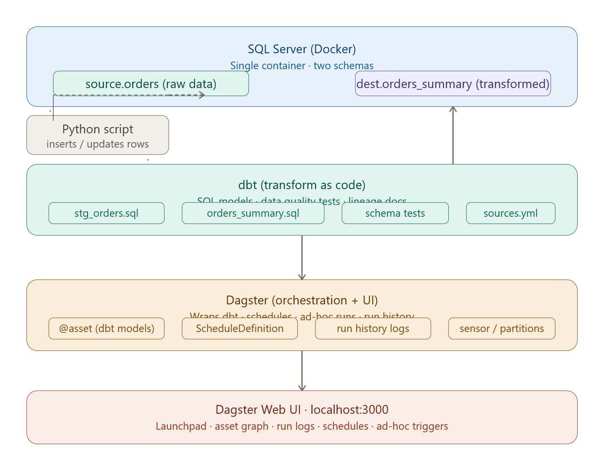
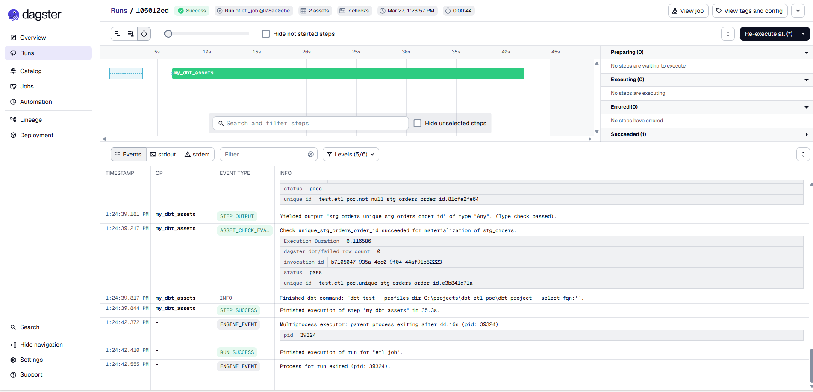
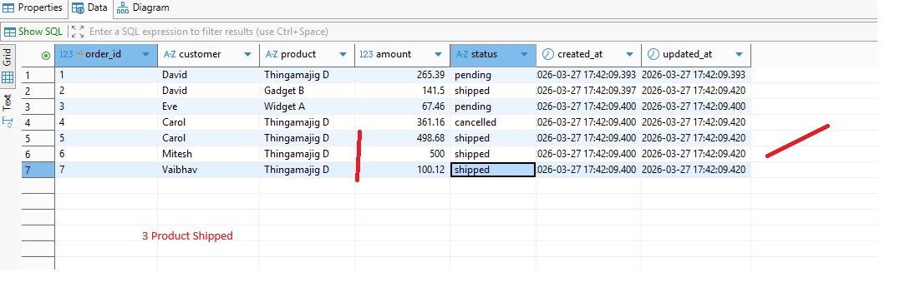
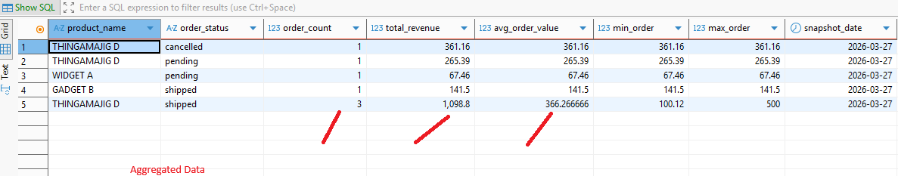

# Commands

```
uv init
uv add dagster dagster-webserver dagster-dbt dbt-sqlserver pyodbc python-dotenv
```

# Activate venv

`source .venv/Scripts/activate`

# Check If venv is activated
`python -c "import sys; print('Activated' if sys.prefix != sys.base_prefix else 'Not activated')"`


# Project Commands

`uv run python scripts/setup_db.py`
`uv run python scripts/simulate_data.py`

# Run DBT
```
cd dbt_project
uv run dbt debug --profiles-dir .      # verify connection
uv run dbt run --profiles-dir .        # run models
uv run dbt test --profiles-dir .       # run quality tests
uv run dbt docs generate --profiles-dir .  # generate lineage docs
uv run dbt docs generate --profiles-dir . # serve docs
```

# RUN Dagster

```
cd dbt-etl-poc

uv run dagster dev -m dagster_project
```
# Debug Notes
- Changed localhost → 127.0.0.1 in .env to force IPv4
- Added Encrypt=no; to the connection string for Docker compatibility







Source Table 



Target Table 


